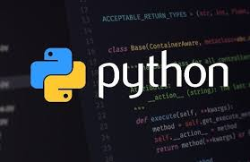

# Python OOP Lesson Series

## 

## Lesson 1 - Setting up the project repo

### Road Map & Work Log

- [ ] The README page (this page)
- [ ] The .gitignore file
- [ ] Project File Structure
- [ ] Python venv's
- [ ] Pygame

## Session Log

Date | Work Done | Commit Desc. | Version
---------- | ------------- | --------- | --------
06.05.24 | **EDIT HERE** | initial commit | 1.0.0

### My Work

{Your Name Here and some Emojis :bowtie: }
